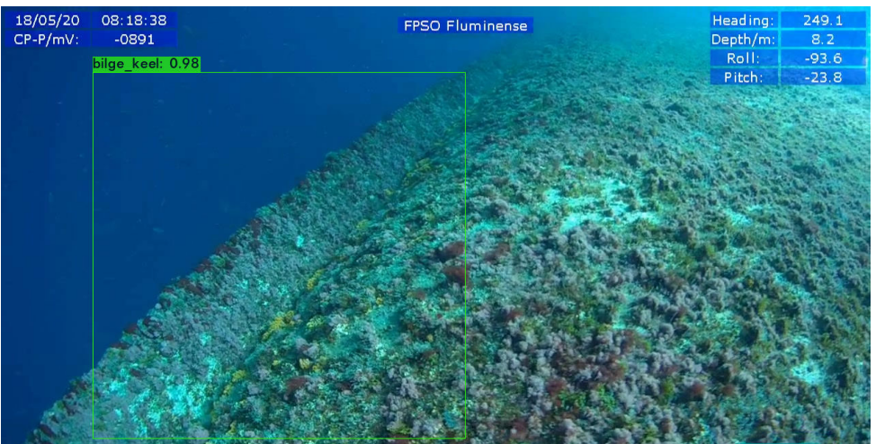
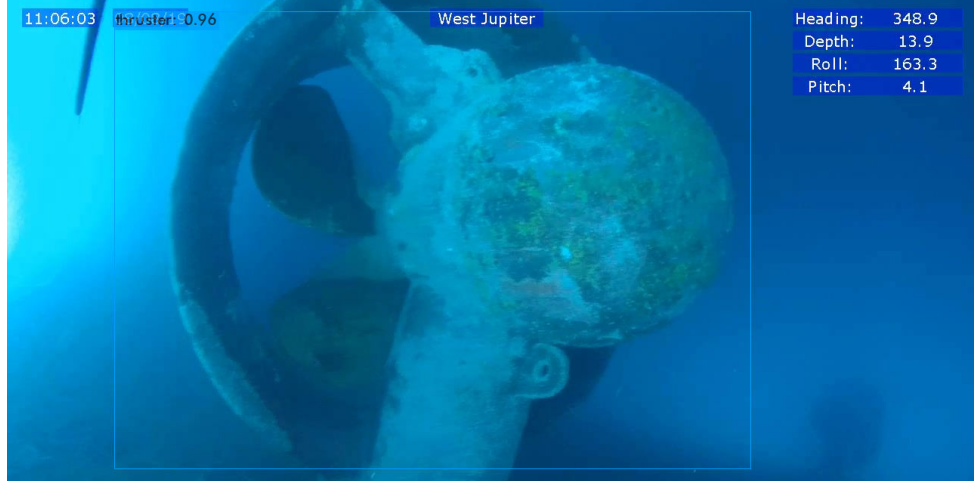

# YOLOv4-Cloud-Training

In this project we walk through the steps of training a custom Yolov4 model for UWILD survey.

PROJECT: 
Biofouling on vessels causes drag, decreasing the efficiency of the vessel through the water and inturn increasing the carbon footprint.
Symbytech uses submersible drones to clean the biofouling from hulls while using machine learning for identification and navigation.

PIPELINE:

1) Data:
        - from video footage 1365 images were taken
        - labelled (with https://github.com/DanC6312/Yolo-Voc_image_labelling)
        - Augmented an aditional 682 images
2) Model:
        - YoloV4 & Yolov4-Tiny (https://arxiv.org/ftp/arxiv/papers/2011/2011.04244.pdf)
3) Training:
        - Trained on Colab free GPU using the notebook above
4) Model conversion:
        - Model was then converted to Tensorflow lite 
4) Results: 

5) Conclusion:
        - With the limited amount of data available the accuracy of classification is low
### YOLOv4-Tiny Video Example

Cheers
Dan
